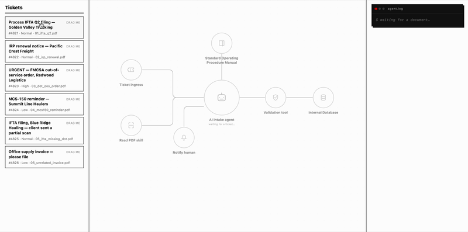

# Sky Transport Intake Agent

A demo of an agentic AI pipeline automating a repeated standard task for a trucking-services company. Submitted for Sky Transport Solutions' **Sky Innovation** candidate project, **Automate** track.

<p align="center">
  
</p>

---

## The Problem

Sky Transport Solutions files compliance paperwork on behalf of trucking clients: IFTA fuel-tax filings, IRP plate renewals, DOT correspondence. Every incoming document currently needs a person to read it, figure out what type it is, pull out the right fields, and file it.

This is repeated, rules-driven work that eats staff time in small increments every day, and where a missed deadline has real consequences.

## The Idea

This project watches for incoming compliance paperwork, reads it, figures out what it is, and either files it automatically or flags it for a person to check, using an AI agent that checks its own work against the company's written procedures before it takes any action.

An agent receives a work ticket with a PDF attached, decides for itself which tools it needs, consults the company's "Standard Operating Procedure" manual for policy, and either files the document or routes it to a human, with the whole reasoning process streamed live into a diagram and a terminal-style log.

## The Implementation

- The agent gets a **toolbox** (search the SOP, read the PDF, record a classification, record extracted fields, validate, persist, notify a human) and decides the order and necessity of each step itself.
- The agent's work is checked against **deterministic rules**, so the LLM's judgment can inform the outcome, but cannot hallucinate "I validated this" and file bad data.
- The SOP itself, required fields per document type, urgency thresholds, escalation rules, lives in a markdown file the agent looks up via RAG, not logic baked into the prompt or the code.
- Everything the agent does streams live to the UI, so an employee watching it work can see *why* it made a decision, not just the final filed record.
- Records persist to SQLite.


### Running it

```bash
# backend
cd backend
python -m venv .venv && .venv/bin/pip install -r requirements.txt
cp .env.example .env   # add an API key for your chosen provider, or set SKY_INTAKE_FAKE_LLM=1 for an offline run
.venv/bin/uvicorn app.main:app --reload --port 8811

# frontend (separate terminal)
cd frontend
npm install
npm run dev
```

Open the frontend, drag a sample ticket onto the agent hub, and watch it work.

Tests: `.venv/bin/pytest` (offline, uses the fake model). `.venv/bin/pytest tests/test_agent_live.py -v -s` (uses the configured live model's API)

## The Result

Six sample tickets exercise the range of behavior the SOP is meant to enforce:

| Ticket | Document | Outcome |
|---|---|---|
| 4821 | IFTA quarterly filing | Classified correctly, all required fields present → **auto-filed**, flagged urgent (due date inside the 14-day window) |
| 4822 | IRP renewal | Classified correctly → **auto-filed**, flagged urgent (due date inside the 30-day window) |
| 4823 | DOT out-of-service order | Classified correctly → **auto-filed**, flagged urgent regardless of date (per SOP); correctly leaves `response_due_date` null rather than inventing a date from "within 5 business days" |
| 4824 | MCS-150 reminder letter | Classified correctly → **auto-filed**, not flagged urgent |
| 4825 | IFTA filing missing USDOT number | Classified correctly, but missing the primary-key field → **routed to human review** rather than guessed |
| 4826 | Unrelated invoice | Correctly classified `UNKNOWN` → **routed to human review** rather than misfiled |

## The Learning

The biggest thing I learned building this is how much is actually happening around the model in a working agentic pipeline. It's easy to assume the AI is doing the heavy lifting, but a language model on its own just receives text and returns text, nothing more. What makes it look capable of judgment calls, adapting to an unfamiliar document, deciding when to escalate to a person, is the engineering built around it, not the model itself.

Retrieval-augmented generation (RAG) is one piece of that: it lets you shape what the model knows and responds to by feeding it the right context at the right moment, instead of retraining or fine-tuning a model on custom data. LangGraph is the other piece: it's what turns a single request/response call into an actual agentic loop, letting the model reason step by step, decide which tool to call next, and keep working toward a goal instead of stopping after one reply. Neither technology makes the model smarter on its own. Together, they're what turns raw text-in, text-out capability into something that can handle an open-ended task, figure out what a document is, judge whether it's urgent, know when to hand off to a person, without anyone training a custom model to do it.

---

## Tech stack

- **Backend:** FastAPI, LangGraph (`create_react_agent`), LangChain, Claude (`claude-haiku-4-5`), Chroma (local embeddings), SQLite, SSE

- **Frontend:** React 19, React Flow (`@xyflow/react`), Vite, TypeScript, Vitest
